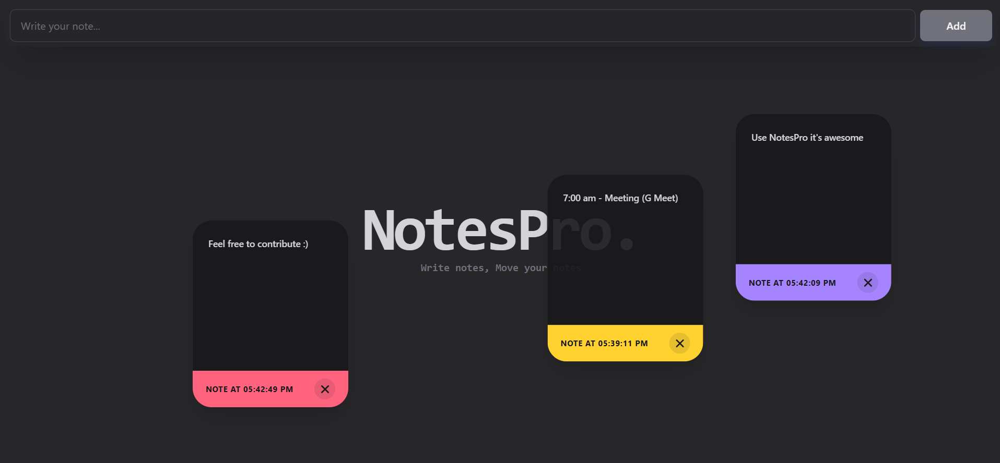

# 📝 NotesPro – Draggable Notes Application

NotesPro is a modern, minimal, and interactive notes-taking web application built using React.js, Tailwind CSS, and Framer Motion.  

Users can create, delete, and drag notes freely across the screen, creating a flexible and dynamic note management experience.

---

## 🚀 Live Demo
Check out- https://notes-pro-eight.vercel.app/


---

## ✨ Features

- ➕ Add new notes
- ❌ Delete notes
- 💾 LocalStorage persistence (notes saved even after refresh)
- 🖱 Drag & Drop functionality using Framer Motion
- 🎨 Modern UI with Tailwind CSS
<!-- - 📱 Fully responsive design -->
- ⚡ Fast and lightweight

---

## 🛠 Tech Stack

- React.js (Functional Components + Hooks)
- Tailwind CSS
- Framer Motion (Drag Animations)
- LocalStorage API

---

## 📦 Installation

Clone the repository:

```bash
git clone https://github.com/rohanroc/NotesPro